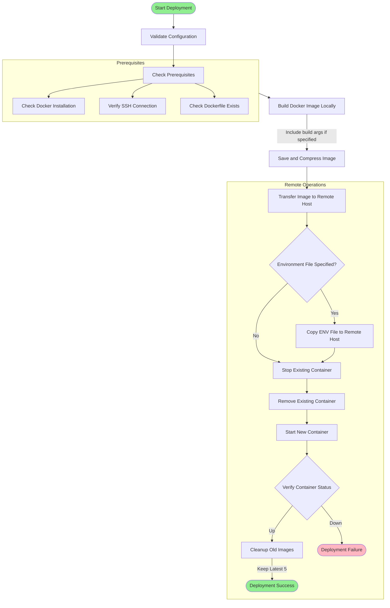
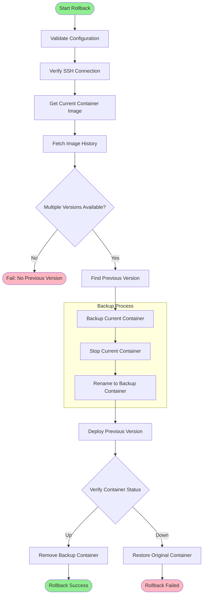

# Deployment

```mermaid

flowchart TD
    Start([Start Deployment]) --> ValidateConfig[Validate Configuration]
    ValidateConfig --> CheckPrereq[Check Prerequisites]

    subgraph Prerequisites
        CheckPrereq --> CheckDocker[Check Docker Installation]
        CheckPrereq --> CheckSSH[Verify SSH Connection]
        CheckPrereq --> CheckDockerfile[Check Dockerfile Exists]
    end
    
    Prerequisites --> BuildImage[Build Docker Image Locally]
    BuildImage --> |"Include build args if specified"| SaveImage[Save and Compress Image]
    
    SaveImage --> TransferImage[Transfer Image to Remote Host]
    
    subgraph Remote Operations
        TransferImage --> CheckEnvFile{Environment File Specified?}
        CheckEnvFile --> |Yes| CopyEnvFile[Copy ENV File to Remote Host]
        CheckEnvFile --> |No| StopContainer[Stop Existing Container]
        CopyEnvFile --> StopContainer
        
        StopContainer --> RemoveContainer[Remove Existing Container]
        RemoveContainer --> StartContainer[Start New Container]
        StartContainer --> VerifyContainer{Verify Container Status}
        
        VerifyContainer --> |"Up"| CleanupImages[Cleanup Old Images]
        CleanupImages --> |"Keep Latest 5"| Success([Deployment Success])
        VerifyContainer --> |"Down"| Failure([Deployment Failure])
    end
    
    style Start fill:#90EE90
    style Success fill:#90EE90
    style Failure fill:#FFB6C1

```

# Rollback

```mermaid

flowchart TD
    Start([Start Rollback]) --> ValidateConfig[Validate Configuration]
    ValidateConfig --> CheckSSH[Verify SSH Connection]

    CheckSSH --> GetCurrentImage[Get Current Container Image]
    GetCurrentImage --> FetchHistory[Fetch Image History]
    
    FetchHistory --> CheckVersions{Multiple Versions Available?}
    CheckVersions --> |No| FailNoVersion([Fail: No Previous Version])
    
    CheckVersions --> |Yes| FindPrevious[Find Previous Version]
    
    FindPrevious --> BackupProcess[Backup Current Container]
    
    subgraph Backup Process
        BackupProcess --> StopCurrent[Stop Current Container]
        StopCurrent --> RenameContainer[Rename to Backup Container]
    end
    
    RenameContainer --> DeployPrevious[Deploy Previous Version]
    
    DeployPrevious --> VerifyStatus{Verify Container Status}
    
    VerifyStatus --> |"Up"| CleanupSuccess[Remove Backup Container]
    CleanupSuccess --> Success([Rollback Success])
    
    VerifyStatus --> |"Down"| RestoreBackup[Restore Original Container]
    RestoreBackup --> FailRestore([Rollback Failed])
    
    style Start fill:#90EE90
    style Success fill:#90EE90
    style FailNoVersion fill:#FFB6C1
    style FailRestore fill:#FFB6C1

```
